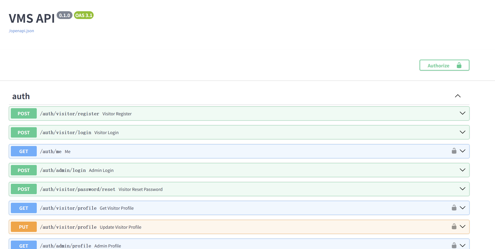
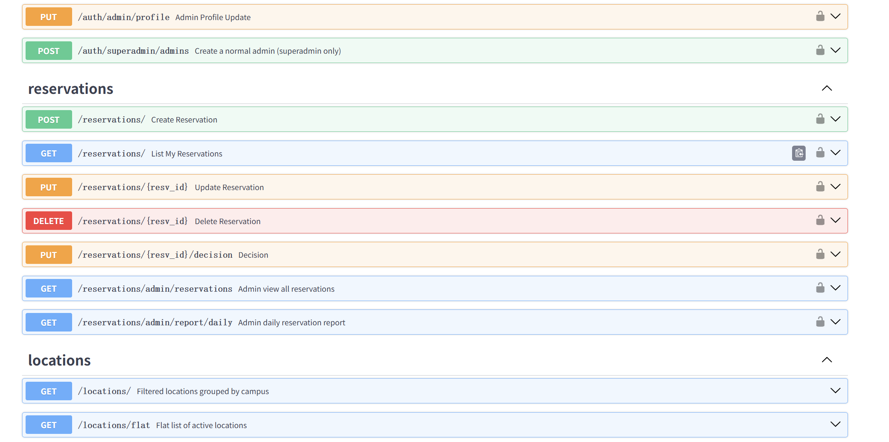
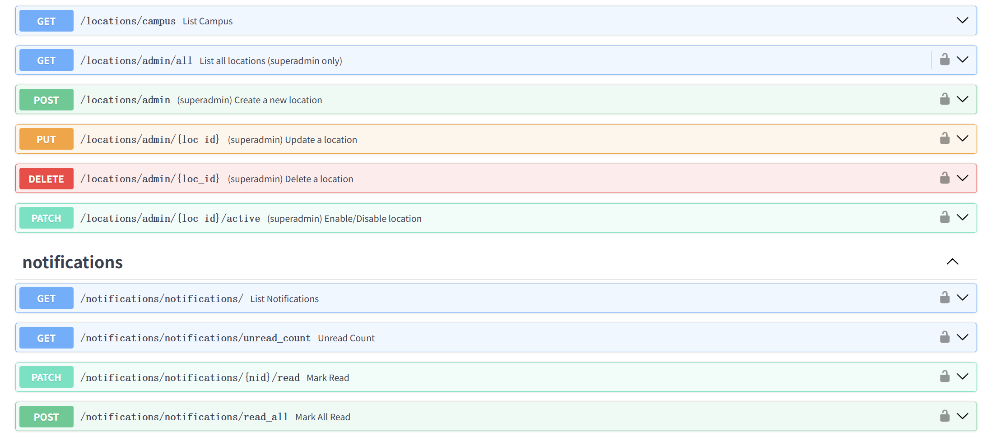
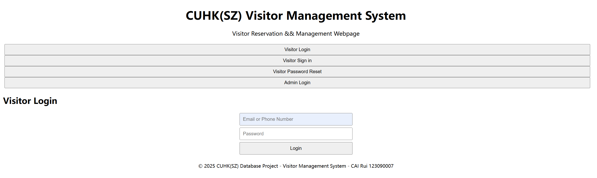
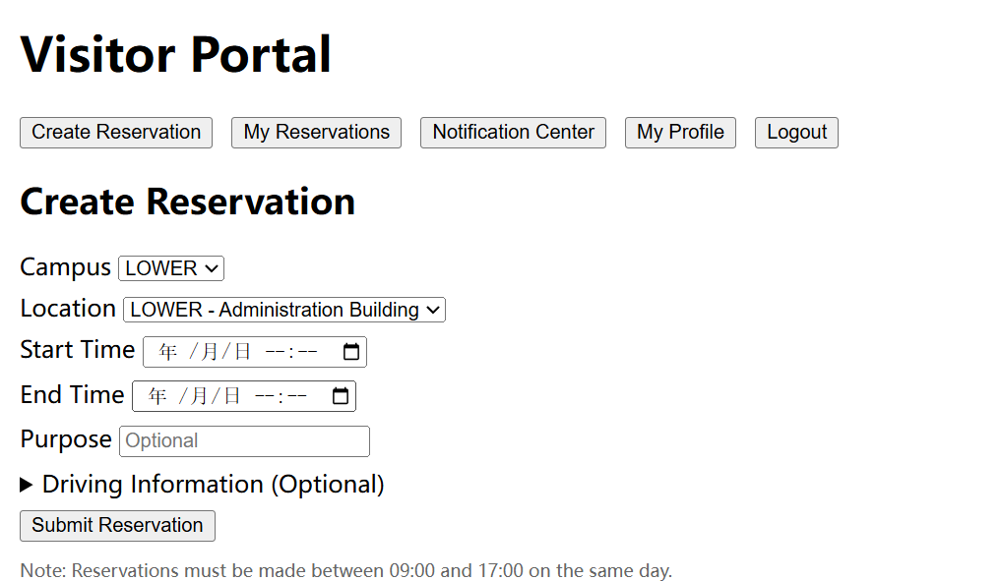
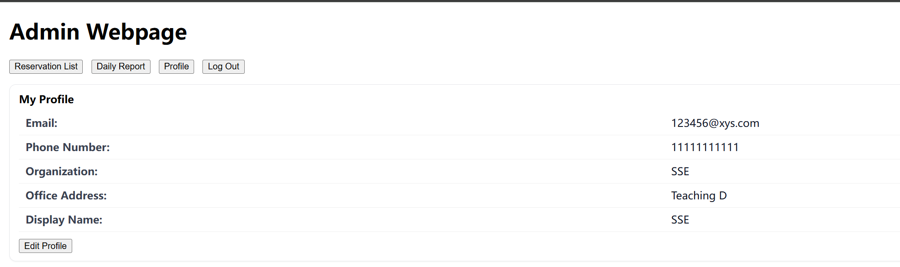
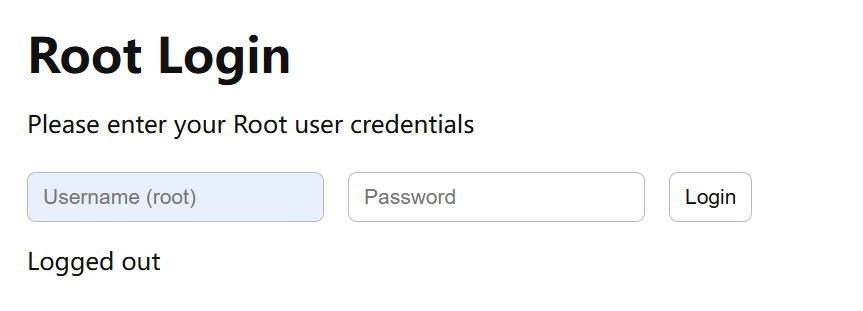
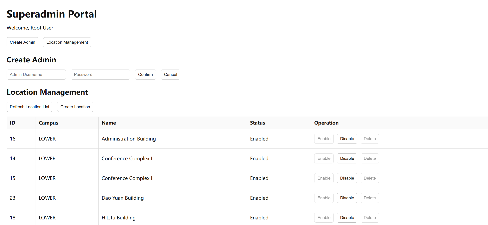

---

````markdown
# 🧾 CSC3170 DBMS Project (2025 Fall)  
**Author:**   
**Student ID:**  
**Course:** CSC3170 DBMS
**Institution:** CUHKSZ

---

## 🏫 Project Overview
This project implements a full-stack **Visitor Management System (VMS)** for CUHKSZ,  
built with **FastAPI** (backend) and **HTML/CSS/JS** (frontend).  
It supports three roles: **Visitor**, **Admin**, and **Superadmin (Root)**,  
for managing visit reservations, approvals, and campus locations.

---

## ⚙️ Environment Setup

### 1️⃣ Using Miniconda (Recommended)
```bash
conda env create -f env.yml
conda activate CSC3170
````

### 2️⃣ Using pip

```bash
conda create -n CSC3170 python=3.11
conda activate CSC3170
pip install -r requirements.txt
```

---

## 🚀 Run Instructions

### 📦 Step 1: Unzip the Project

If you received this project as a compressed `.zip` file,
please unzip it first to any directory you prefer.

For example:

```bash
unzip CSC3170_VMS.zip
cd CSC3170_VMS
```

Now you should see folders like `server/`, `client/`, and files such as `env.yml` and `README.md`.

---

### ▶️ Step 2: Start Backend Server

> ⚠️ **Important:** The following command must be run inside the `app` folder
> (not in the root or `server` directory).

```bash
cd server
uvicorn app.main:app --reload --port 8000
```

You can check API documentation here:
👉 [http://127.0.0.1:8000/docs](http://127.0.0.1:8000/docs)

---

### 💻 Step 3: Start Frontend Client

> ⚠️ **Important:** This command must be run inside the `client` directory.

Open a new terminal (keep the backend running), then execute:

```bash
cd client
python -m http.server 5500
```

This will start a local static server at:
👉 [http://127.0.0.1:5500](http://127.0.0.1:5500)

---

### 🌐 Step 4: Access the System

Once both backend and frontend are running:

| Page                  | URL                                                                  | Description                         |
| --------------------- | -------------------------------------------------------------------- | ----------------------------------- |
| **Root Admin Portal** | [http://127.0.0.1:5500/root.html](http://127.0.0.1:5500/root.html)   | Manage locations and admin accounts |
| **Main Login Page**   | [http://127.0.0.1:5500/index.html](http://127.0.0.1:5500/index.html) | Login for Admins and Visitors       |

After successful login, users will be redirected automatically to their corresponding dashboard.

---

## 🗂️ Project Structure

```text
CSC3170_VMS/
├── CSC3170_Project_Report.docx
├── CSC3170_Project_Report.pdf
├── CSC3170_Demo.mp4
├── env.yml
├── Readme.md
├── requirements.txt
├── vms.db
├── .vscode/
│
├── client/
│   ├── admin.html
│   ├── admin.js
│   ├── api.js
│   ├── index.html
│   ├── index.js
│   ├── root.html
│   ├── root.js
│   ├── style.css
│   ├── visitor.html
│   └── visitor.js
│
├── server/
│   ├── alembic.ini
│   ├── alembic/
│   ├── __pycache__/
│   └── app/
│       ├── auth.py
│       ├── database.py
│       ├── deps.py
│       ├── locations.py
│       ├── main.py
│       ├── models.py
│       ├── notifications.py
│       ├── reservations.py
│       ├── schemas.py
│       ├── settings.py
│       └── __pycache__/
│
└── sql/
    ├── queries.sql
    └── schema.sql
```

---

## ⚙️ Tech Stack

| Layer              | Technologies                                   |
| ------------------ | ---------------------------------------------- |
| **Backend**        | FastAPI, SQLAlchemy, SQLite, Pydantic, Alembic |
| **Frontend**       | HTML, CSS, Vanilla JavaScript                  |
| **Environment**    | Python 3.11, Miniconda (`environment.yml`)     |
| **Authentication** | JWT (via `python-jose`)                        |

---

## 👥 Default Accounts

| Role               | Username / Phone | Email                                               | Password     |
| ------------------ | ---------------- | --------------------------------------------------- | ------------ |
| 🏛️ **Root Admin**  | root             | —                                                   | Root@123456  |
| 🧰 **Admin1**      | Admin1           | —                                                   | Pwd@123456   |
| 🧰 **Admin2**      | Admin2           | —                                                   | Pwd@123456   |
| 🧰 **Admin3**      | Admin3           | —                                                   | Pwd@123456   |
| 🧰 **Admin4**      | Admin4           | —                                                   | Pwd@123456   |
| 🧰 **Admin5**      | Admin5           | —                                                   | 114514       |
| 👤 **Visitor1**    | 13823573801      | [123090001@gmail.com](mailto:123090001@gmail.com)   | Pwd@123456   |
| 👤 **Visitor2**    | 13823573802      | [123090002@qq.com](mailto:123090002@qq.com)         | Pwd@123456   |
| 👤 **Visitor3**    | 13823573803      | [123090003@amazon.com](mailto:123090003@amazon.com) | Pwd@123456   |
| 👤 **Visitor4**    | 13823573804      | [123090004@meta.com](mailto:123090004@meta.com)     | Pwd@123456   |
| 👤 **Visitor5**    | 11451419198      | [123090005@nvidia.com](mailto:123090005@nvidia.com) | 114514       |

---

## 🧩 Features Summary

### 👤 Visitor

* Register, login, and reset password
* Create, edit, and delete visit reservations
* View reservation status and notifications
* Update personal profile

### 🧰 Admin

* View all visitor reservations
* Approve or deny reservations
* Generate daily reports
* Update admin profile

### 🏛️ Superadmin (Root)

* Manage admin accounts
* Create or delete locations
* Enable / disable locations
* Oversee full system operations

---

## 🖼️ Screenshots

### 🔹 Backend API (FastAPI Docs)

<p align="center">
  
</p>

<p align="center">
  
</p>

<p align="center">
  
</p>

---

### 🔹 Frontend - Index Page

<p align="center">
  
</p>

---

### 🔹 Visitor Dashboard

<p align="center">
  
</p>

---

### 🔹 Admin Dashboard

<p align="center">
  
</p>

---

### 🔹 Root (Superadmin) Index + Dashboard

<p align="center">
  
</p>

<p align="center">
  
</p>

## 👨‍💻 Author

**Name:** 
**Student ID:**
**Institution:** CUHKSZ
**Course:** CSC3170 DBMS (Fall 2025)

---

